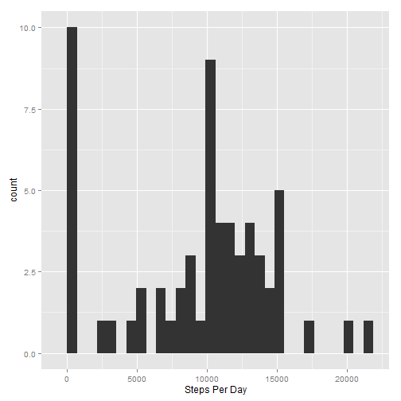
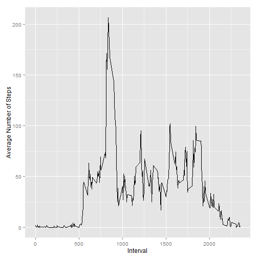
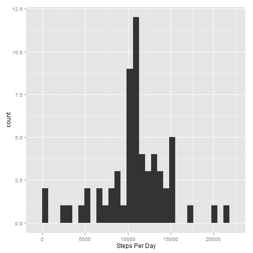
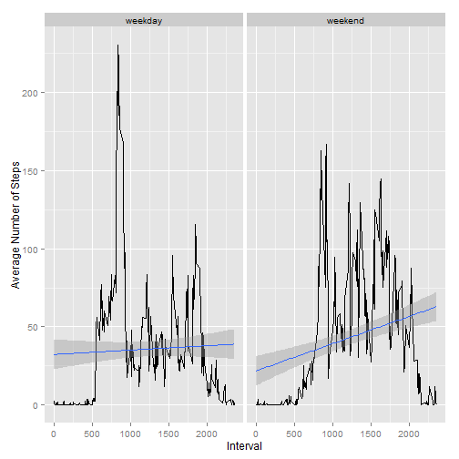

PA1. Activity analysis
======================

### 0. Preliminary stage

At the beginning, we should load required libraries and set default options for our markdown file.


```r
library(ggplot2)
library(plyr)
library(knitr)
opts_chunk$set(echo=TRUE,results="hide")
```

### 1. Loading and preprocessing the data

Next stage - reading and formatting input data.


```r
data<-read.csv("activity.csv")
data$date<-as.Date(data$date)
```

### 2. What is mean total number of steps taken per day?

At this stage we should do the following tasks.

1. Calculate the total number of steps taken per day.


```r
total_steps<-tapply(data$steps,data$date,sum,na.rm=TRUE)
```

2. Make a histogram of the total number of steps taken each day.


```r
qplot(total_steps,xlab="Steps Per Day")
```

 

3. Calculate and report the mean and median of the total number of steps taken per day.


```r
mean_days<-mean(total_steps,na.rm=TRUE)
median_days<-median(total_steps,na.rm=TRUE)
```

Our caclulation shows the following results:

* mean - 9354;

* median - 10395.

Note: NA values were removed from the analysis.

### 3. What is the average daily activity pattern?

To perform analysis of the average daily activity pattern we could use tapply function to calculate means of the steps by the factor - intervals.


```r
mean_interval<-tapply(data$steps,data$interval,mean,na.rm=TRUE)
mean_interval<-data.frame(as.numeric(names(mean_interval)),mean_interval)
colnames(mean_interval)<-c("interval","mean_steps")
```

Time series of means is shown below.


```r
qplot(interval,mean_steps,data=mean_interval,geom="line",xlab="Interval",ylab="Average Number of Steps")
```

 


```r
mean_interval$interval[which(mean_interval$mean_steps==max(mean_interval$mean_steps))]
```

The above code shows that the interval with the highest average number of steps is 835.

### 4. Imputing missing values

As it was mentioned above, our dataset has NA values in the column "steps".

Let's fill in them by average number of steps for such interval (calculated at the previous stage).


```r
length(which(is.na(data$steps)))
data_wo_na<-data
for (i in 1:length(data_wo_na$steps))
      if (is.na(data_wo_na$steps[i]))
            data_wo_na$steps[i]<-mean_interval$mean_steps[which(mean_interval$interval==data_wo_na$interval[i])]
```

And now we can take a quick look at the updated histogram.


```r
total_steps_wo_na<-tapply(data_wo_na$steps,data_wo_na$date,sum)
qplot(total_steps_wo_na,xlab="Steps Per Day")
```

 


```r
new_mean_days<-mean(total_steps_wo_na)
new_median_days<-median(total_steps_wo_na)
```

Statistics of the filled-in data:

* mean - 10766;
* median - 10766.

As we see, both statistics has increased. It is sounds logic because we has increased total number of steps in days that had NAs.

### 5. Are there differences in activity patterns between weekdays and weekends?

Finally, the followng code could be use to look at average number of steps by intervals separetly on weekdays and weekend.


```r
date_dayname<-weekdays(data_wo_na$date)
date_type<-sapply(date_dayname,function(x) {if ((x=="Saturday")||(x=="Sunday"))
      "weekend" else "weekday"})
data_wo_na<-mutate(data_wo_na,date_type=date_type)

mean_interval_wo_na<-tapply(data_wo_na$steps,list(data_wo_na$interval,
                                                  data_wo_na$date_type),mean,na.rm=TRUE)
mean_interval_wo_na<-data.frame(as.numeric(rownames(mean_interval_wo_na)),
                                stack(as.data.frame(mean_interval_wo_na)))
colnames(mean_interval_wo_na)<-c("interval","mean_steps","date_type")

qplot(interval,mean_steps,data=mean_interval_wo_na,geom=c("line","smooth"),
      method="lm",facets=.~date_type,xlab="Interval",ylab="Average Number of Steps")
```

 

Our analysis shows:

* Activity on weekdays starts nearly 500th interval and ends before 2000th interval, while on weekend is starts and ends later: most steps makes between 750th and 2250th interval.

* Activity on weekdays fluctuates less than on weekends, but average activity per day looks to be similar.
